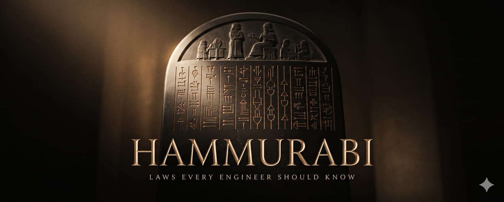

A codex of engineering laws — each with its counter-force, a field guideline, and a source.

[](https://github.com/kanywst/hammurabi/stargazers)
[](https://github.com/kanywst/hammurabi/network/members)
[](https://github.com/kanywst/hammurabi/blob/main/LICENSE)

**English** • [日本語](./README.jp.md)

---

## What is Hammurabi?

In a world of increasing complexity, the primary bottleneck in engineering is no longer **code**, but **decision-making under uncertainty**.

Hammurabi is a curated codex of engineering laws drawn from **Cognitive Psychology**, **Safety Engineering**, and **System Design**. Every law is paired with its **counter-force** (the principle that keeps it from becoming dogma), a **field guideline** you can apply tomorrow, and a **primary source**. It is named for the first written code of laws.

## The Laws

|    Category    |                                     Law                                      |                     The Core Idea                      |
| :------------: | :--------------------------------------------------------------------------: | :----------------------------------------------------: |
|  **Decision**  |       [Type 1 vs Type 2](./content/en.md#1-type-1-vs-type-2-decisions)       |            Reversible vs irreversible doors.            |
|   **Safety**   |  [Normalization of Deviance](./content/en.md#2-normalization-of-deviance)    |       Don't let anomalies become your new normal.       |
|   **Safety**   |         [Swiss Cheese Model](./content/en.md#33-swiss-cheese-model)          |      Accidents happen when holes in layers align.       |
|  **Systems**   |          [Chesterton's Fence](./content/en.md#3-chestertons-fence)           |         Understand the 'Why' before you delete.         |
|  **Culture**   |              [Hanlon's Razor](./content/en.md#12-hanlons-razor)              | Never attribute to malice what is explained by context. |
|   **Design**   |                [Conway's Law](./content/en.md#7-conways-law)                 |          Your software mirrors your org chart.          |
| **Cognition**  |          [Survivorship Bias](./content/en.md#21-survivorship-bias)           |            The dead don't write blog posts.             |
| **Cognition**  |      [Dunning-Kruger Effect](./content/en.md#31-dunning-kruger-effect)       |       The unskilled cannot see they are unskilled.       |
| **Incentives** |           [The Cobra Effect](./content/en.md#23-the-cobra-effect)            |          Solutions that create worse problems.          |
|    **Risk**    |               [Murphy's Law](./content/en.md#28-murphys-law)                 |            Anything that can go wrong, will.             |
| **Complexity** | [Tesler's Law](./content/en.md#30-teslers-law-of-conservation-of-complexity) |        Complexity is conserved, only relocated.         |
| *...and more*  |                 [Explore the full codex →](./content/en.md)                  |                                                        |

## The Site

An engraved, editorial companion site renders all the laws as a numbered code of articles (§ 01–35).

```bash
cd website
npm install
npm run dev
```

Visit `http://localhost:3000` to read the codex.

## Contributing

We welcome laws that have a strong basis in **Cognitive Science** or **Engineering History**.

1. Check the existing [codex](./content/en.md).
2. Ensure your proposal follows the **Concept / Mechanism / Counter / Guideline / Source** structure. The `Source` line must cite the original author, paper, or book — not a blog post that summarizes one.
3. Add the entry to both `content/en.md` and `translations/jp.md`, then append the short form (`title / tag / mechanism / counter / guideline / source`) to the `en` and `jp` arrays in `website/src/translations/index.ts`.
4. Open a PR.

## License

MIT © 2026 Hammurabi.
